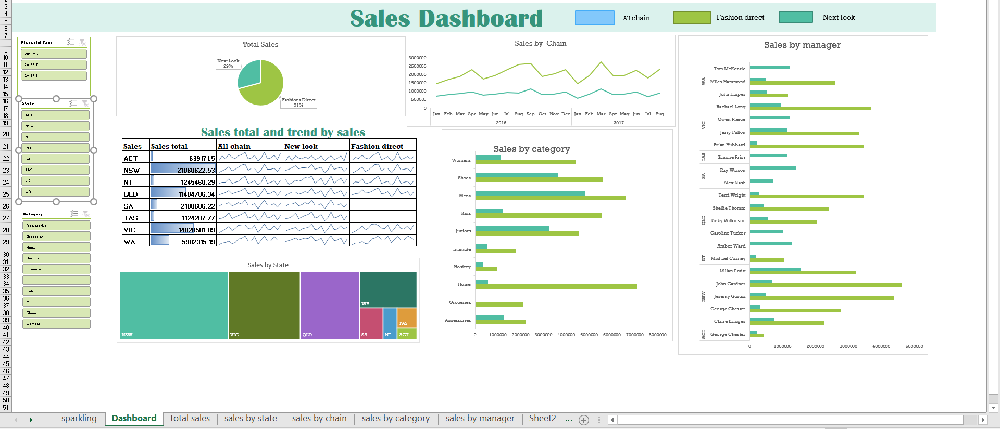

# Retail Sales Performance Dashboard

## Project Overview
An interactive Excel dashboard built to analyze sales performance across different states, categories, chains, and managers.

## Tools Used
- Microsoft Excel
- Pivot Tables
- Pivot Charts
- Slicers
- Conditional Formatting
- Sparklines

## Key Insights
- Sales performance by state
- Sales trends across chains
- Category-wise sales analysis
- Manager performance comparison
- Interactive filtering by year, state, and category

## Dashboard Preview

